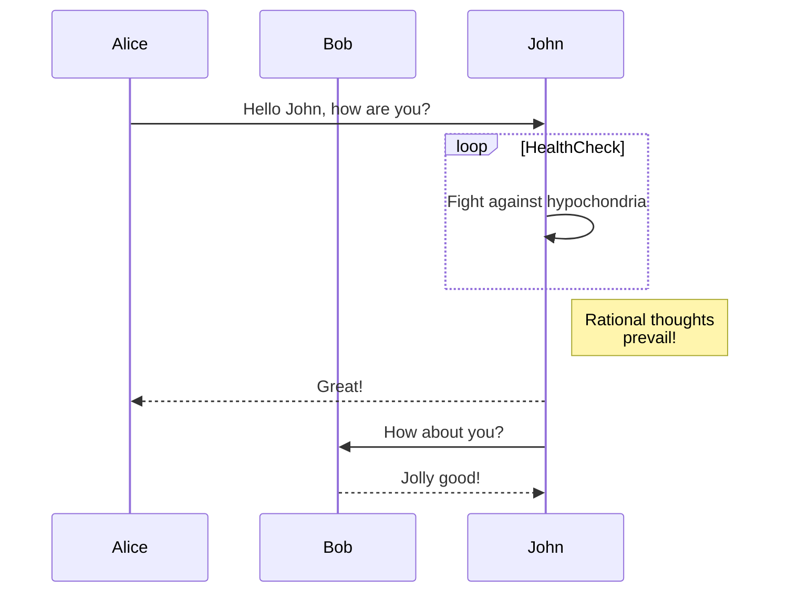

# Managed Streaming Kafka
This module will create a Kafka cluster with 2 nodes. It allows access only from the cooresponding Kafka client ec2 instance.

Ref: [Get Started with Amazon Managed Streaming for Apache Kafka (MSK) | Amazon Web Services](https://www.youtube.com/watch?v=5WaIgJwYpS8)

## Kafka Client EC2 Setup
```
sudo yum install java

wget https://archive.apache.org/dist/kafka/3.8.1/kafka_2.12-3.8.1.tgz
tar -xvf kafka_2.12-3.8.1.tgz 

# set region to "us-east-2", leave everything else blank
aws configure

aws kafka list-clusters
```

## Kafka Client Topic and Message Testing
Create a topic
```
export KAFKA_CLUSTER_ARN=$(aws kafka list-clusters | jq -r '.ClusterInfoList[0].ClusterArn')
export KAFKA_CLUSTER_SERVERS=$(aws kafka get-bootstrap-brokers --cluster-arn "$KAFKA_CLUSTER_ARN" | jq -r '.BootstrapBrokerStringTls')
export KAFKA_TOPIC="CodebeneathTopic"

cd kafka_2.12-3.8.1/bin

./kafka-topics.sh --create --bootstrap-server "$KAFKA_CLUSTER_SERVERS" --replication-factor 2 --partitions 1 --topic "$KAFKA_TOPIC"

./kafka-topics.sh --bootstrap-server "$KAFKA_CLUSTER_SERVERS" --list
```

### Producer runs from this shell
```
./kafka-console-producer.sh --bootstrap-server "$KAFKA_CLUSTER_SERVERS" --topic "$KAFKA_TOPIC"
exit
```

### Consumer runs from another shell
```
./kafka-console-consumer.sh --bootstrap-server "$KAFKA_CLUSTER_SERVERS" --topic "$KAFKA_TOPIC" --from-beginning
exit
```

